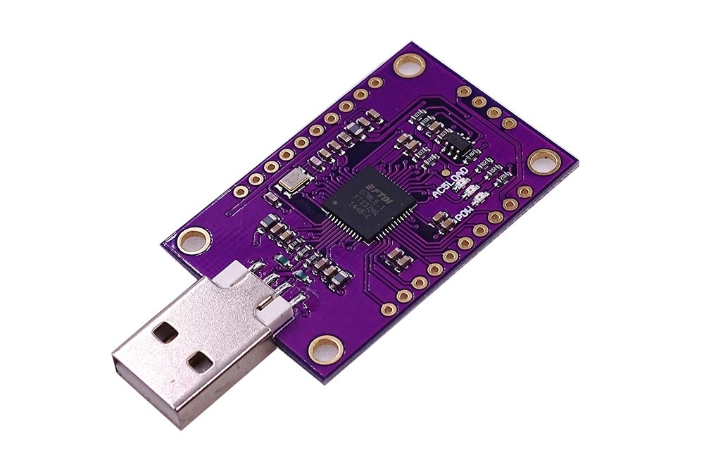
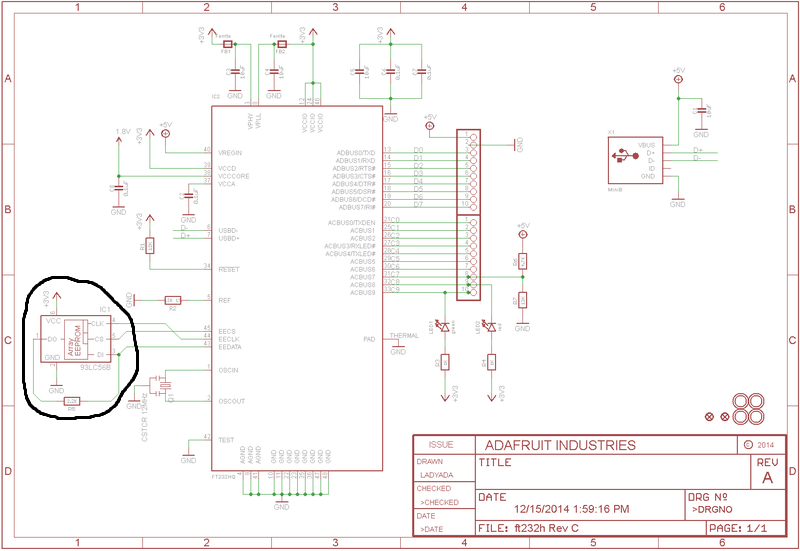
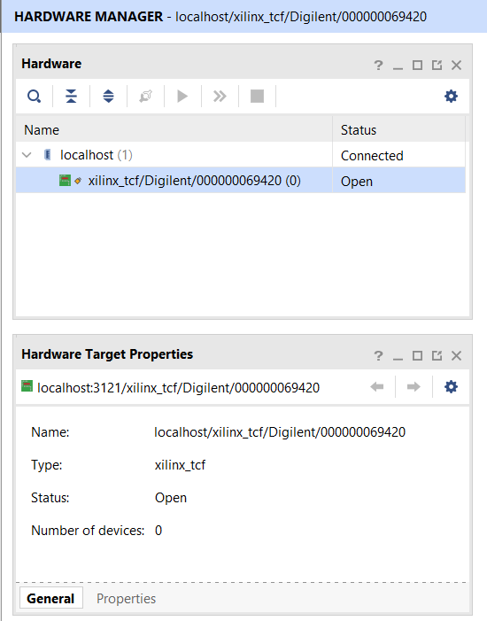

# Cracking FT232H to make Digilent JTAG Programmer



The Digilent JTAG uses FTDI chips, but its configuration EEPROM contains data needed to be recoginzed by Xilinx ISE/Vivado. For patch dongle you will need GNU Linux, but the patched FT232H doggle also works on Windows. The schematic below is for the Adafruit FT232H debugger. By flashing the EEPROM I marked, we will make Vivado see the CJMCU Debugger as Digilent HS2.




## Installing requirements:

Following command install requirements for Ubuntu:

```bash
vagrant@vagrant:~$ sudo apt-get update && sudo apt-get install libftdi1 ftdi-eeprom -y
```

## Clone Repository

```bash
vagrant@vagrant:~$ git clone https://github.com/erd0spy/ft232h_to_digilent_fpga_programmer/
vagrant@vagrant:~$ cd ft232h_to_digilent_fpga_programmer/
```

## Recognize FT232H debugger:

```bash
vagrant@vagrant:~$ sudo dmesg
...
[  100.106743] usb 1-1: new high-speed USB device number 3 using ehci-pci
[  211.929880] usb 1-1: new high-speed USB device number 3 using ehci-pci
[  211.931050] usb 1-1: New USB device found, idVendor=0403, idProduct=6014, bcdDevice= 9.00
[  211.932440] usb 1-1: New USB device strings: Mfr=1, Product=2, SerialNumber=3
[  211.933030] usb 1-1: Manufacturer: FTDI
[  211.933180] usbcore: registered new interface driver usbserial_generic
[  211.933493] usbserial: USB Serial support registered for generic
[  211.937191] usbcore: registered new interface driver ftdi_sio
[  211.937621] usbserial: USB Serial support registered for FTDI USB Serial Device
[  211.937836] ftdi_sio 1-1:1.0: FTDI USB Serial Device converter detected
[  211.937958] usb 1-1: Detected FT232H
[  211.944099] usb 1-1: FTDI USB Serial Device converter now attached to ttyUSB0
```

dmesg command will return `idVendor` and `idProduct` for FT232H debugger. We will need this information to update the `digilent_jtag.conf`.

## Update digilent_jtag.conf:

Example digilent_jtag.conf for CJMCU FT232H Debugger:

```
vendor_id=0x0403
product_id=0x6014

flash_raw=true

filename="digilent_hs2.bin"
```

## Flashing FT232H debugger:

```bash
vagrant@vagrant:~$ sudo ftdi_eeprom --flash-eeprom digilent_hs2.conf 

FTDI eeprom generator v0.17
(c) Intra2net AG and the libftdi developers <opensource@intra2net.com>
FTDI read eeprom: 0
EEPROM size: 256
FIXME: Build FT232H specific EEPROM settings
Used eeprom space: 244 bytes
Flashing raw eeprom from file digilent_hs2.bin (256 bytes)
FTDI write eeprom: 0
FTDI close: -1
```

## Testing JTAG Debugger:

### Testing on Linux:

```bash
vagrant@vagrant:~$ sudo dmesg
...
[   63.225408] usb 1-1: new high-speed USB device number 3 using ehci-pci
[   63.572960] usb 1-1: New USB device found, idVendor=0403, idProduct=6014, bcdDevice= 9.00
[   63.572963] usb 1-1: New USB device strings: Mfr=1, Product=2, SerialNumber=3
[   63.572964] usb 1-1: Product: Digilent USB Device
[   63.572965] usb 1-1: Manufacturer: Digilent
[   63.572966] usb 1-1: SerialNumber: 000000069420
[   63.580159] ftdi_sio 1-1:1.0: FTDI USB Serial Device converter detected
[   63.580187] usb 1-1: Detected FT232H
[   63.587695] usb 1-1: FTDI USB Serial Device converter now attached to ttyUSB0
vagrant@vagrant:~$ 
```

### Testing on Windows with Vivado:


